# SysAdminHCP

**A modern, self-hosted web hosting control panel.**

🌐 [sysadminhcp.com](https://sysadminhcp.com) &nbsp;|&nbsp; 🔧 [microrepair.net](https://microrepair.net)

> **By downloading, cloning, installing, or otherwise using this software, you accept
> the terms of the [End User License Agreement](LICENSE.md).** SysAdminHCP is
> proprietary, commercial software distributed here as a compiled binary release —
> no application source code is included in this repository.

---

## What is SysAdminHCP?

SysAdminHCP is a full-featured hosting control panel for managing web servers, DNS,
mail, databases, and hosting clients from a single dashboard — self-hosted, single
binary, no external dependencies beyond the services it manages.

It runs directly on the server it manages (AlmaLinux 8/9/10 or Ubuntu 22.04+), driving
your existing Apache/Nginx, BIND, qmail, MariaDB, and Pure-FTPd stack rather than
replacing them, so you keep full control of the underlying system.

## Screenshots

| | |
|---|---|
| 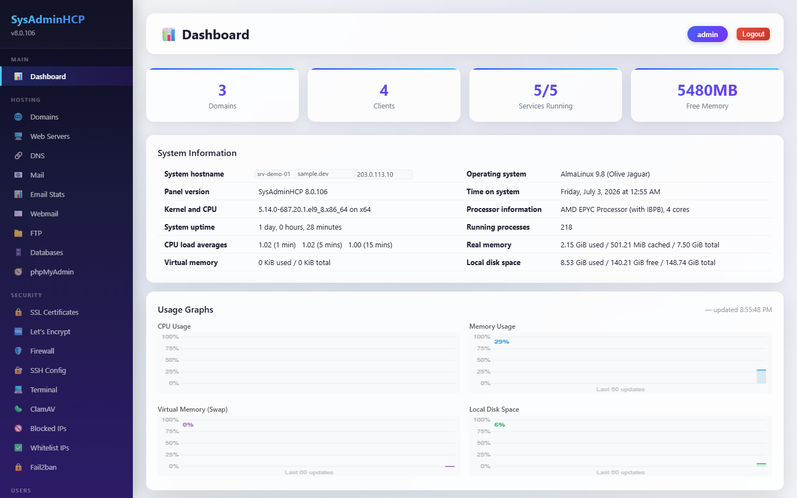 Dashboard | 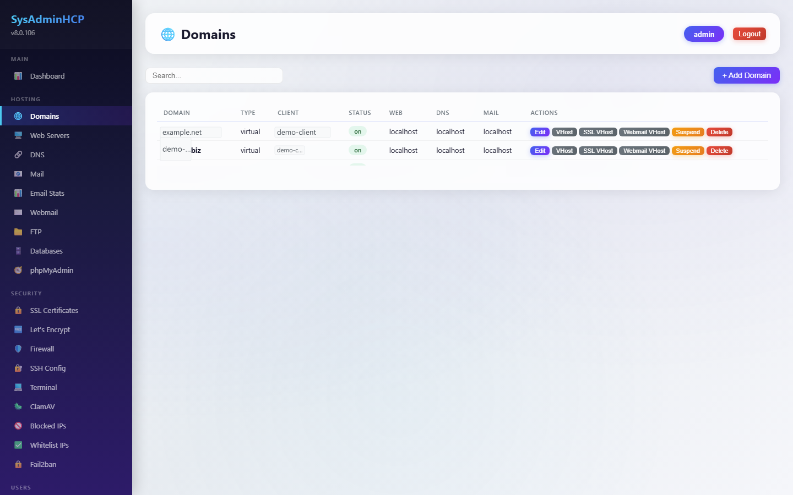 Domains |
| 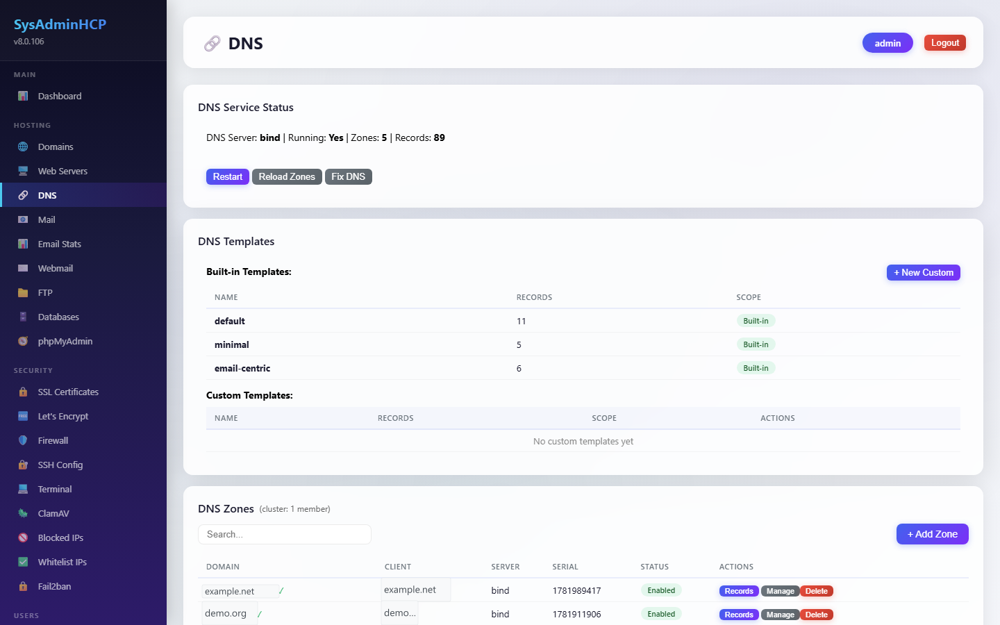 DNS Zones | 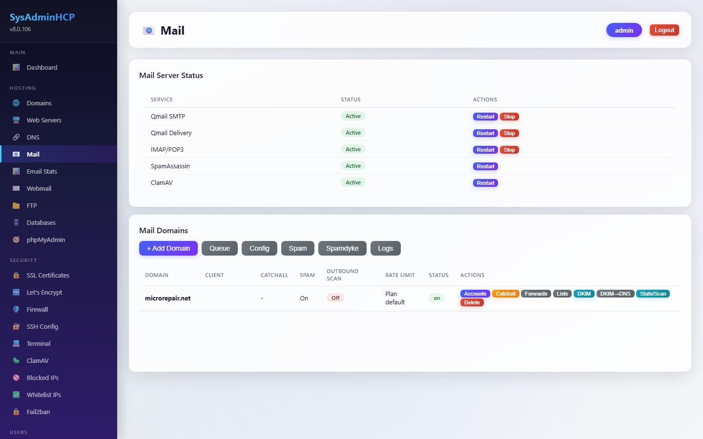 Mail |
| 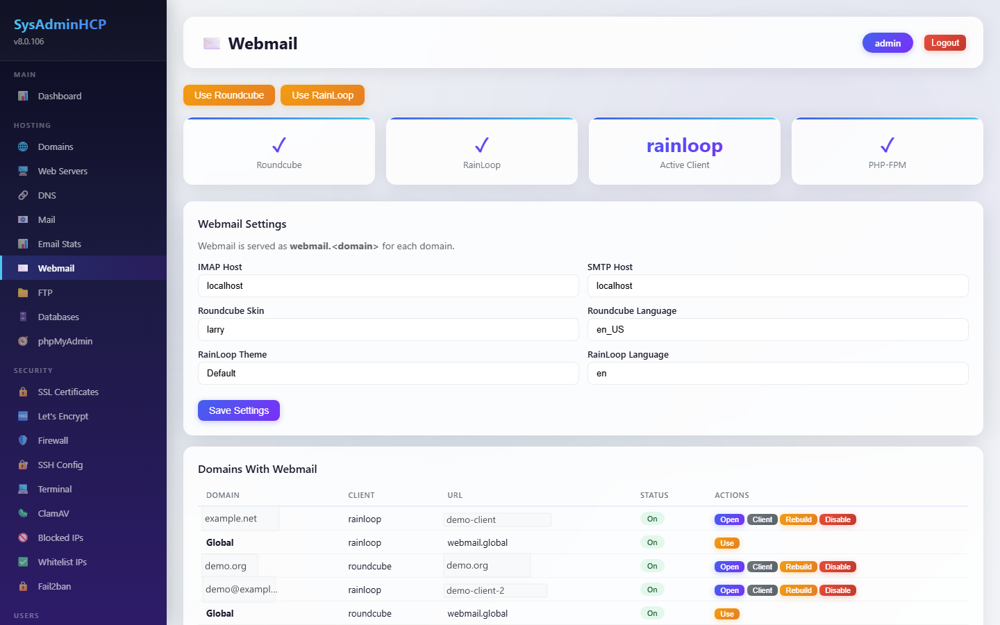 Webmail | 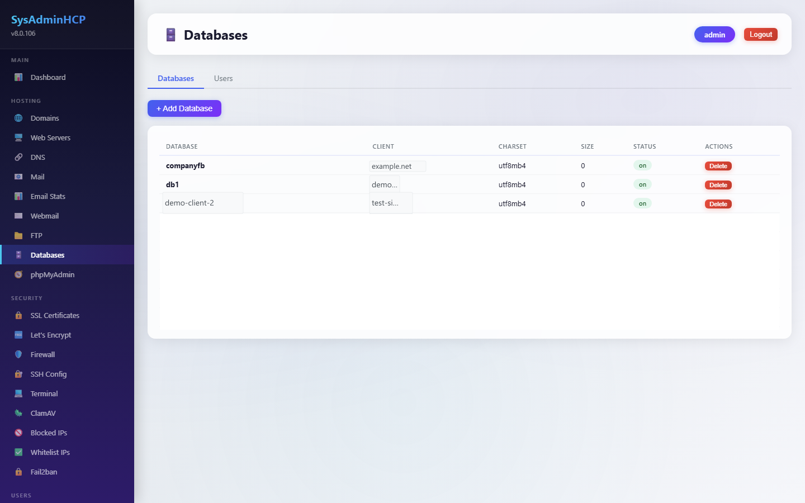 Databases |
| 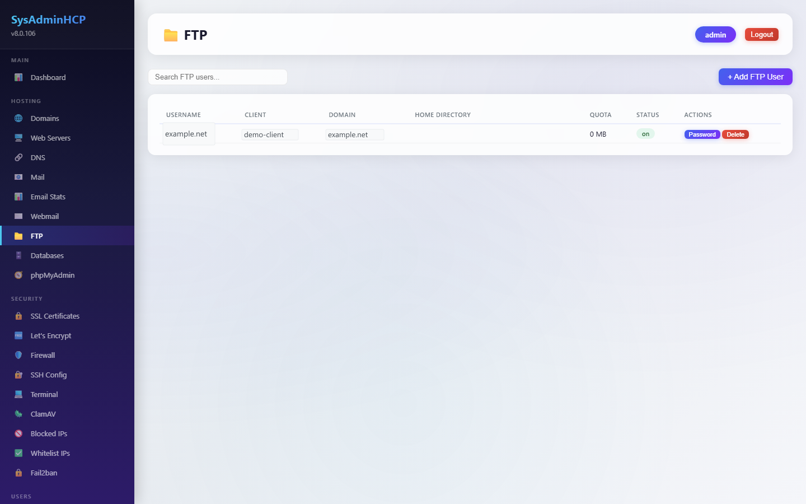 FTP Accounts | 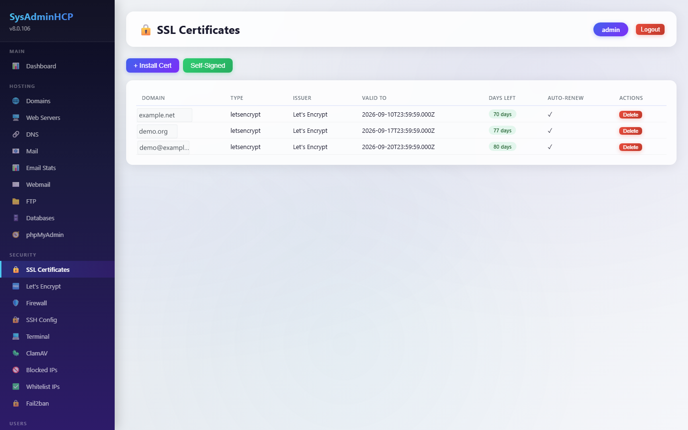 SSL / Let's Encrypt |
| 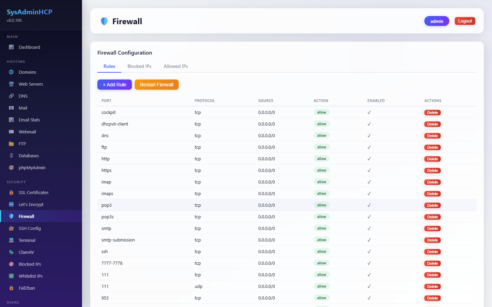 Firewall | 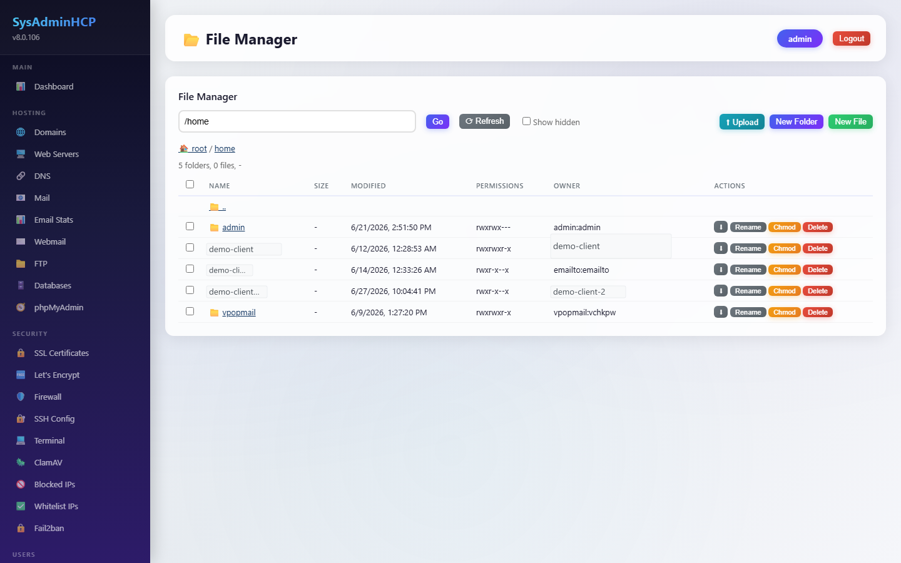 File Manager |
| 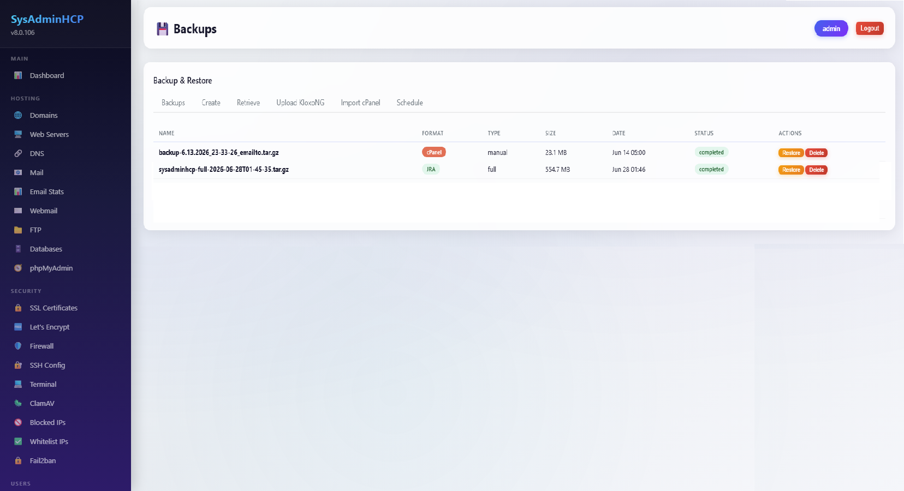 Backups | 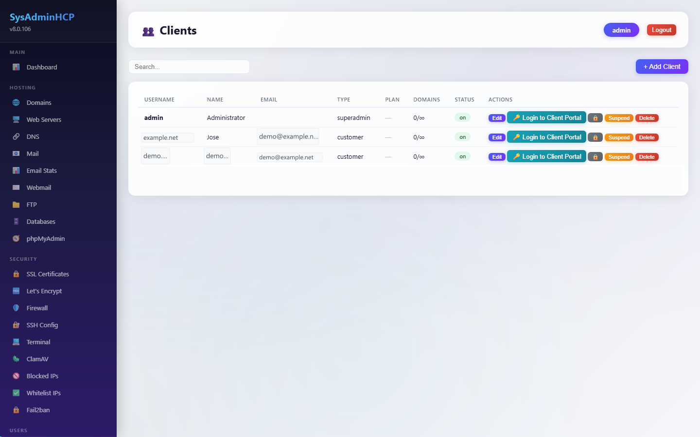 Client Management |
| 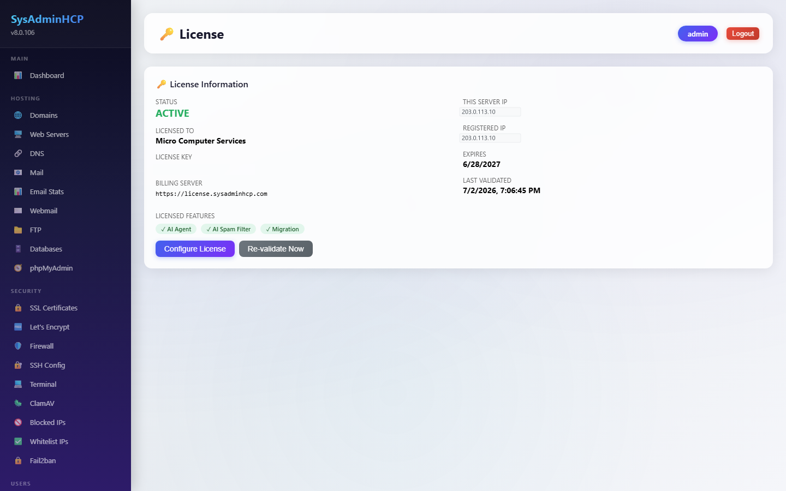 License | 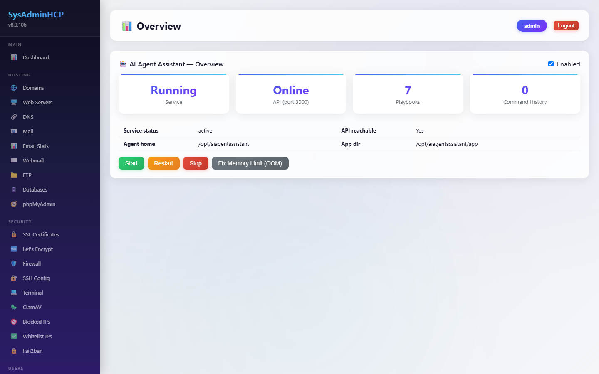 AI Agent (Pro) |
| 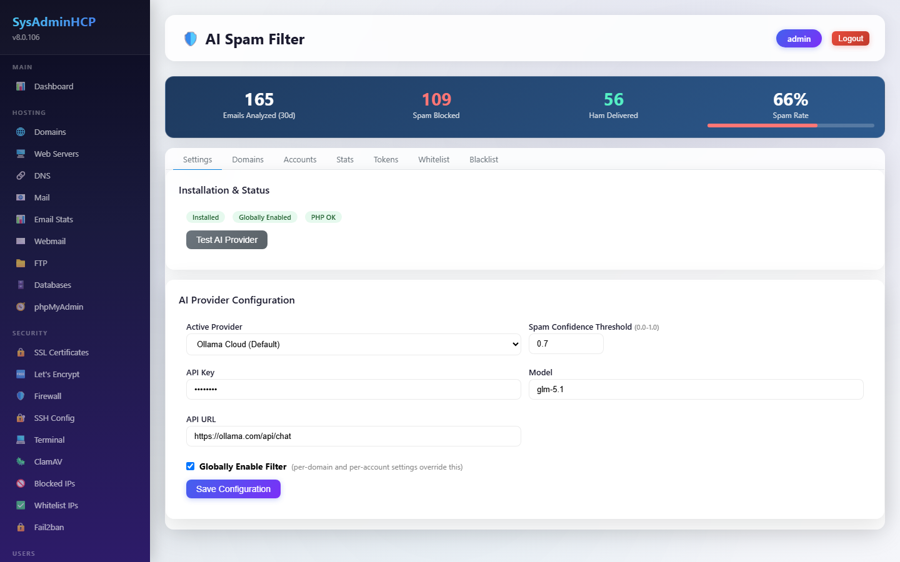 AI Spam Filter (Pro) | 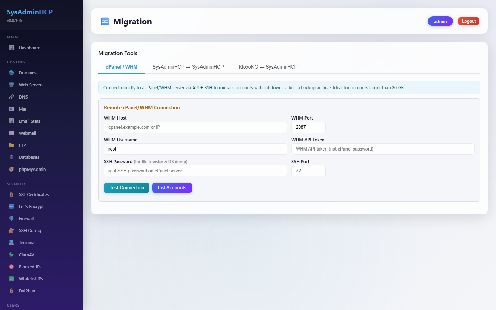 Migration Tools (Pro) |

## Features

- **Web hosting** — Apache, Nginx, Lighttpd, Hiawatha, and OpenLiteSpeed vhost management, PHP-FPM multi-version support, SSL/Let's Encrypt automation
- **DNS** — BIND, djbdns, MaraDNS, MyDNS, NSD, PowerDNS, and YADIFA zone/record management, bulk IP updates
- **Mail** — qmail-based mail server, mailboxes, forwards, mailing lists, webmail (RainLoop), spam whitelist/blacklist
- **Databases** — MySQL/MariaDB database and user management with phpMyAdmin single sign-on
- **FTP** — Pure-FTPd account management
- **Security** — firewall management, IP whitelist/blacklist, Fail2ban, ClamAV
- **File Manager** — browser-based file management with proper Unix ACL/permission handling
- **Backups** — full client and domain backup/restore, including cPanel and KloxoNG import
- **Client Management** — multi-client hosting accounts with resource plans
- **Web Statistics** — GoAccess-powered traffic stats per domain
- **Cron Jobs** — scheduled task management per client
- **AI Agent** *(Pro)* — AI-assisted SSH terminal and system administration from the browser, plus **Autonomous Mode**: continuous background monitoring of system health, support tickets, security activity, and backups, with specific actions (restart a service, reply to a ticket, retry a failed backup, etc.) available for delegation — every action stays off until explicitly enabled, each with its own confirmation
- **AI Spam Filter** *(Pro)* — AI-powered email spam filtering (OpenAI, Claude, Gemini, Ollama, or GitHub Copilot providers)
- **Migration Tools** *(Pro)* — import hosting accounts from cPanel, KloxoNG, or another SysAdminHCP server
- **DNS Import & Multi-Server Sync** *(Pro)* — import zones from any remote BIND server (including split/`include`-based configs) and keep DNS in sync across a multi-server cluster

## Recent Highlights (v8.0.19x)

- **Autonomous Mode expanded** — AI Agent monitoring now covers backups (overdue/failed detection, disk usage) and system resources (memory, disk), alongside the existing tickets/services/security scopes, each with its own opt-in delegated action.
- **Scheduled backups fixed end-to-end** — the backup schedule feature now actually runs on cron, on both traditional and single-binary installs, with correct retention pruning and a real timeout that can't leave a runaway process behind.
- **DNS Import fixed for split-config servers** — importing zones from panels that split `named.conf` across multiple included files (e.g. KloxoNG) now correctly discovers and imports them.
- **General CLI reliability fix** — command-line invocations (used by cron for backups, quota collection, etc.) now exit cleanly on completion instead of hanging.

## Free vs. Pro

| | Free | Pro |
|---|---|---|
| Price | $0 — lifetime | $24 / year |
| License scope | Unlimited installs (self-registered) | 1 host/IP per license |
| Hosting menu (Domains, Web Servers, DNS, Mail, FTP, Databases, phpMyAdmin, Webmail, Email Stats) | ✅ | ✅ |
| Backups (manual + scheduled, cPanel/KloxoNG import) | ✅ | ✅ |
| AI Agent (chat + Autonomous Mode monitoring/delegation) | ❌ | ✅ |
| AI Spam Filter | ❌ | ✅ |
| Migration Tools (cPanel / KloxoNG / SysAdminHCP) | ❌ | ✅ |
| DNS Import & Multi-Server Sync | ❌ | ✅ |

A license (Free or Pro) is required to unlock the Hosting menu — new installs get a
5-day grace period to register before it locks. Manage your license and upgrade to
Pro at [sysadminhcp.com](https://sysadminhcp.com).

## Installation

### Option A: One-line install (recommended)

Run this as root on a fresh AlmaLinux 8/9/10 or Ubuntu 22.04+ server:

```bash
curl -fsSL https://raw.githubusercontent.com/jorodriguezpr/sysadminhcp/main/autoinstall.sh | sudo bash
```

`autoinstall.sh` detects your OS, installs `git`/`git-lfs` if needed, clones this
repository to `/usr/local/src/sysadminhcp`, verifies the binary downloaded
correctly, and automatically runs the installer that matches your distro — no
manual steps required.

### Option B: Manual clone + install

If you'd rather review everything before running it:

```bash
# 1. Install prerequisites (git-lfs is required - the binary is stored via Git LFS,
#    without it you'll only get a pointer file, not the actual binary)
sudo apt-get update && sudo apt-get install -y git git-lfs   # Ubuntu/Debian
sudo dnf install -y git git-lfs                              # AlmaLinux/RHEL (EPEL may be needed)

# 2. Clone this repository
git clone https://github.com/jorodriguezpr/sysadminhcp.git
cd sysadminhcp

# 3. Run the installer that matches your OS
sudo bash deploy/install-almalinux8.sh     # AlmaLinux 8 / RHEL 8 clones
sudo bash deploy/install-almalinux9.sh     # AlmaLinux 9 / RHEL 9 clones
sudo bash deploy/install-almalinux10.sh    # AlmaLinux 10 / RHEL 10 clones
sudo bash deploy/install-ubuntu22.sh       # Ubuntu 22.04+ / Debian
```

Either way, the installer detects the pre-built binary automatically and installs
it directly — no TypeScript build, no compilation step. It sets up the full stack
(web server, DNS, mail, database, firewall) and starts SysAdminHCP as a systemd
service.

### First login

```
http://<server-ip>:7778/display
Username: admin
Password: admin
```

**Change the default password immediately after your first login.**

See [`deploy/README.md`](deploy/README.md) for detailed per-OS installer notes,
service management, and troubleshooting.

## License

SysAdminHCP is proprietary software. See [`LICENSE.md`](LICENSE.md) for the full
End User License Agreement, including Free/Pro terms, restrictions, and warranty
disclaimer.

## Links

- Product & licensing: [https://sysadminhcp.com](https://sysadminhcp.com)
- Support: [https://microrepair.net](https://microrepair.net)
